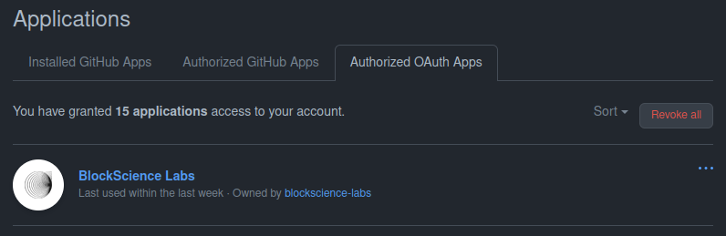
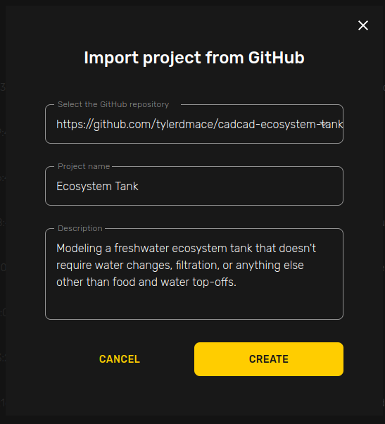
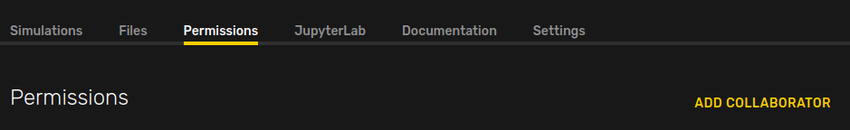

# Getting Started
## Account Registration
First things, first: registering your account! Using the Labs platform is free to all users for most features but does require a handful of things in order to make those features available to you.

### Linking your GitHub Account
During registration you will be asked to link your GitHub account. While this isn't strictly required to use the platform, many features will be unavailable until you do this as the platform relies on GitHub for project storage and version control. We have further integrations planned (GitLab, BitBucket, Radicle, etc) but as of now, you'll want to have a GitHub account (free tier is more than sufficient) in order to maximize the usefulness of our platform.

!!!info
    You are able to connect a GitHub account after registration if you skip it the first time around. You can also *"disconnect"* an active connection from here although you will have to go to GitHub to truly revoke access.
    

### Email Confirmation
Immediately following the registration of your account, you will be emailed at the email address you used to register. Please find that email and click the confirmation link to verify ownership of your email address.

### Adding a Payment Method
Lastly, you'll need to add a payment method to your Labs account even if you are on the free tier. This allows a la carte execution of models on our execution cluster and also enables protections against abusive or malicious accounts being created.

!!!info
    Adding a payment method *does not* sign you up for anything nor will those payment methods ever be charged without explicit confirmation on your part before hand.

## Projects
Projects are the at the heart of all the work you will do on the platform and serve as the workspace in which you will do it. A project consists of an associated Git repository (and the actual modeling work that goes along with it), a list of collaborators, and an optional docsite (static documentation site generated from markdown).

### Creating/Importing a New Project
The first thing you're going to do after logging into Labs for the first time is import a project from GitHub. In the future, you will be able to create a new GitHub repository/project directly from Labs but for now you will need to create the repo/project ahead of time directly in GitHub and then import into Labs afterwards.

To import a repository, click `New Project` from the `Projects` screen.

Next, you can search for and select any of the repositories that belong to your own GitHub user, any of the GitHub organizations you belong to, or any repos that you have explicitly been granted access to. For public repos that do not belong to you or any organization you're a member of, you'll need to first fork the repo somewhere for it to be importable.

Give your project a good name and a simple description and you're off to the races.

## Collaborators
Collaborators are people you want to have access to project resources either for collaboration on work or perhaps as a sort of read-only role. Adding collaborators is easy and only requires that the person already have an account on the Labs platform. To invite someone to your project, click `Add Collaborator` from the `Permissions` tab of your projects page.

!!!info
    You will not be presented with any sort of message indication success or failure of an invite to collaborate. This is to protect the privacy of our users. Please ensure before hand that the account indeed exists and that you have entered the email address correctly.
    
Additionally, from the `Permissions` tab you can also see current collaborators, their activity status, and have the ability to remove collaboration access from them.