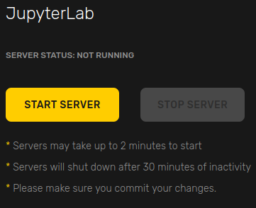
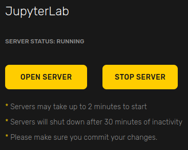

# Development
Development of your model can be done within the Labs platform by utilizing several features and services; primarily, a JupyterLab server instance that provides a full-featured Python IDE for you to use, an SDK for interacting with the Labs platform programmatically, and a distributed model execution service that can make speedy work of running your model.

## Starting/Stopping JupyterLab
Every user on the Labs platform can spin up a JupyterLab server to work on the project files that are contained within the associated GitHub repository. This includes users who do not have direct access to the GitHub repo but have been added to the project as a collaborator.

To spin up a JupyterLab instance for a project, click the `Start Server` button on the `JupyterLab` tab of the projects page.

Once the server has started (should take less than a minute but may take up to about five depending on platform utilization), the `Start Server` button will change to `Open Server`. You can click this same button to launch the JupyterLab instance in a new tab. Additionally, you should be able to stop your server at this point, too, once it's no longer needed.

!!!warning
    JupyterLab server instances are automatically cleaned up after 30 minutes of inactivity so please remember to commit and push any changes you make so that you don't lose work.
    
## Using JupyterLab