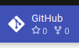
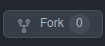

# BlockScience Labs: Demonstration Models
A curated list of models for demonstration and educational purposes.

## Specifications & Configurations
All the contained models are built against <a href="https://pypi.org/project/cadCAD/0.4.28/" target="_blank">cadCAD v0.4.28</a> (legacy) and are ready to be executed on the Labs execution cluster.

## Models
### Bonding Curve
See [Bonding Curve](bonding-curve/index.md).

### Conviction Voting
See [Conviction Voting](conviction-voting/index.md).

### Predator/Prey
See [Predator/Prey](predator-prey/index.md).

### Predator/Prey (Agent-based model)
See [Predator/Prey (Agent-based model)](predator-prey-abm/index.md).

### Robots & Marbles
See [Robots & Marbles](robots-and-marbles/index.md).

## Play with them!
The easiest way to start playing with these models is to first fork the Github repository by clicking the link to the repository in the upper right hand corner of this site:

Forking the project:

And finally, importing the fork into your Labs account:

 